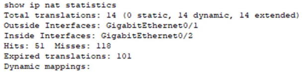

# Test 3:

## LAN Design Lab:

Hab ich fett nicht gemacht

## VPN Lab:


## OSPF Lab:
### Configuration:
#### Router:
```
router ospf 10
router-id 1.1.1.1
network 192.168.13.0 0.0.0.255 area 0
//optional for Internet
passive-interface gig0/0
default-information originate
ip route 0.0.0.0 0.0.0.0 gig0/0
ip route 0.0.0.0 0.0.0.0 (ip vom Internet)
//cost (kommt aufs interface)
int fa0/1
ip ospf cost 196
```
### Debug:
**debug ip ospf events**
mit dem Debug sieht man dann die OSPF messages

- `OSPF events debugging is on` confirms that OSPFdebuggin is on
- `01:22:14` Timestamp when the èvent occurred
- `OSPF: Rev hello from 1.1.1.1 area 0 fromSerial0/0/0 172.31.4.1` The Router received a"hello" packet from 1.1.1.1, the sender area is 0,received on interface Serial0/0/0 with the ip 17231.4.1
- `OSPF: End of hello processing` The routerfinished the processing of the "hello".
### show's:
**show ip ospf neighbor:**

- `Neighbor ID`:  ID of the OSPF neighbor
- `Pri`: priority of the neighbor (lower number =lower priority)
- `State`: current state (Full = OSPF adjacency isfully established; Down = no "hello" recieced yet,Init = has received "hello" but no router ID,2-Way = both routers got "hello" and routerdecieds if they should become neighbors, )
- `Dead Time`: time until neighbor is considerddead
- `Ddress`: IP Address of the neighbor
- `Interface`: interface which the OSPF adjacencyis established
**show ip ospf database**

LSA = Link-State Advertisement (packets used byOSPF routers to exchange information about thenetwork topology.)
- `OSPF Router with ID (1.1.1.1) (Process ID 1)`:which router the command is done on
- `Router Link States (Area 0)`:  shows all linkstates in this area
- `Link ID`: link ID associated with each LSA
- `ADV Router`: Router ID's in the LSA
- `Age`: age of the LSA (in seconds)
- `Seq#`: shows the sequence number (32-bit numberto track the version of the LSA)
- `Link count`: Each link represents a connectionor interface associated with the router or network

**show ip ospf interface:**

- all infos of the ospf config on an interface onthe Router (kein Plan jungs sorry)


## ACl Lab:
ACL's are used to control and filter traffic based on defined criteria.

### Configuration: 

**In and Out ACL Configuration**

Configure ACLs for interface s0/0/0:
```
int s0/0/0
 ip access-group SURFING out
 ip access-group BROWSING in
```
**Standard ACL**
```
access-list 1 permit 192.168.30.0 0.0.0.255
```
**Extended ACL for BROWSING**
```
ip access-list extended BROWSING
 permit tcp any any established
 permit icmp any any echo-reply
 permit udp any any

```
**Extended ACL for SURFING**
```
ip access-list extended SURFING
 permit tcp 192.168.13.0 0.0.0.255 11.13.0.0 0.0.0.255 eq www
 permit tcp 192.168.13.0 0.0.0.255 11.13.0.0 0.0.0.255 eq 443
 permit tcp 192.168.13.0 0.0.0.255 11.13.0.0 0.0.0.255 eq ftp
 permit udp 192.168.13.0 0.0.0.255 11.13.0.0 0.0.0.255 eq domain
 permit icmp 192.168.13.0 0.0.0.255 11.13.0.0 0.0.0.255 echo
 permit udp any eq bootpc any eq bootps
Host ACL
```

**Host ACL**
```
permit tcp 10.1.219.0 0.0.0.255 host 55.219.219.219 eq www
```

### Debug:
**Context:**

**debug ip packet:**

### show's:
**show access-lists:**

  - shows Nat config and matches
  - matches = packets that matched the ACL entry

## NAT Lab:
 allow devices on a local network to share a single public IP address for communication with the internet.
 ### Configuration (von Richi's Journal will nd abtippen:):


### Debug:
**debug ip nat:**

- `NAT: s=192.168.202.4->10.202.0.1, d=10.202.0.2 [30]` 
    - Source IP address of the packet = 192.168.202.4 
    - is translated to a destination IP address of 10.202.0.2
    - this way it can reach its intended destination
    - `d=10.202.0.2 ` is the intended destination
  - `NAT *: s=10.202.0.2, d=10.202.0.1->192.168.202.4 [34]`
    - translation in the opposite direction
    - source IP address of 10.202.0.2 translated to a destination IP address of 192.168.202.4

### show's:
**show ip nat statistics:**

  - show generell infos
  - `Hits:` NAT translations have been successfully matched and processed
  -  `Misses:` packets that did not match any existing translation rules.
  -  `Expired translations: `Translations typically expire after a certain period of inactivity.
  
**show ip nat translations:**

  - `Inside global:` the translated IP addresses and ports as seen from the outside network
  - `Inside local:` original IP addresses and ports of the devices within the local network
  - `Outside local:` IP addresses and ports of the destination servers or devices in the external network
  - `Outside global:` translated IP addresses and ports of the destination servers as seen from the outside network.

## DHCP Lab

### Configuration:
**DHCPv4 Server:**

```
ip dhcp excluded-address (IP von) (IP bis)
ip dhcp excluded-address (IP)
ip dhcp pool LAN-POOL-1
    network (IP + Subnet)
    default-router (IP + Subnet)
    dns-server (zB 1.1.1.1 or 8.8.8.8)
    domain-name (name).spengergasse.at
```

**DHCPv4: CLient:**

```
interface (zB g0/1)
ip address dhcp
no shutdown
```

### show's:
show ip dhcp binding:

  - show's the assigned ip adress wirh the  mac addres from the client